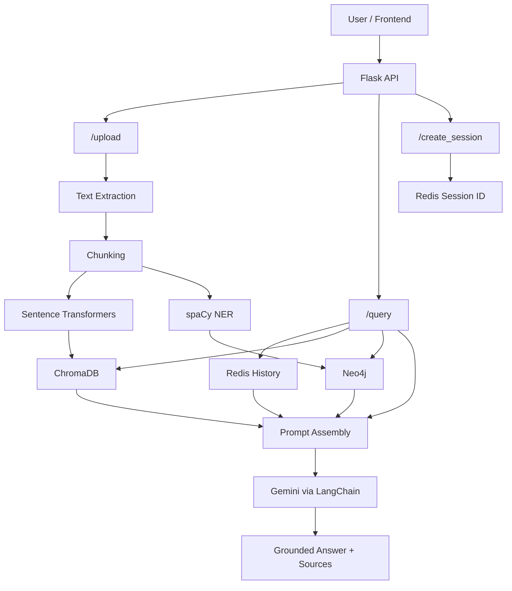

# Legal RAG Processor

A hybrid legal question-answering backend that combines:

- retrieval-augmented generation (RAG)
- semantic search with ChromaDB
- graph-aware context expansion with Neo4j
- session memory with Redis
- grounded answer generation with Gemini via LangChain

This project is built as a backend-first legal AI system that can ingest legal documents, index them, retrieve relevant passages, and answer user questions with source-aware context.

## Why This Project

Legal documents are long, technical, and difficult to navigate with plain keyword search. This project improves legal information access by combining vector retrieval, graph structure, and conversational context in a single pipeline.

Instead of asking an LLM to answer from memory, the system:

1. ingests legal files
2. extracts and chunks text
3. embeds and stores the chunks in ChromaDB
4. stores document and entity structure in Neo4j
5. keeps session history in Redis
6. retrieves the most relevant evidence at query time
7. generates an answer grounded in the retrieved material

## What It Does

- Upload legal documents in `PDF`, `DOCX`, and `TXT`
- Extract and chunk document text
- Generate embeddings with Sentence Transformers
- Store semantic vectors in Chroma Cloud
- Build a lightweight legal knowledge graph in Neo4j
- Track session history in Redis
- Combine vector retrieval and graph-derived context
- Answer user queries with source-oriented citations
- Expose a clean Flask API for integration with a frontend

## Architecture



## Tech Stack

| Layer | Technology |
|---|---|
| Backend API | Flask |
| CORS | Flask-CORS |
| LLM | Gemini via `langchain-google-genai` |
| Embeddings | Sentence Transformers |
| Vector Store | Chroma Cloud |
| Graph Store | Neo4j |
| Session Memory | Redis |
| NLP / NER | spaCy |
| File Parsing | PyPDF2, python-docx |

## Project Structure

```text
legal-rag/
├── app.py                         # Flask app, API routes, query pipeline
├── vectorstore.py                 # Chroma indexing and semantic search
├── graphstore.py                  # Neo4j graph persistence and graph retrieval
├── requirements.txt               # Python dependencies
├── report_update_current_stage.md # Report-aligned project summary
└── uploads/                       # Temporary uploaded files
```

## Core Flow

### 1. Document Ingestion

The `/upload` endpoint:

- accepts a file
- extracts text from the file
- chunks the text into overlapping windows
- stores chunk embeddings in ChromaDB
- stores document and chunk nodes in Neo4j
- extracts named entities using spaCy
- links chunks to entities in the graph

### 2. Query Processing

The `/query` endpoint:

- receives a user question
- optionally loads prior conversation from Redis using `session_id`
- performs semantic retrieval from ChromaDB
- extracts entities from the query and retrieved chunks
- fetches graph-related chunk context from Neo4j
- merges vector and graph context
- sends prompt + history + context to Gemini
- returns answer and source metadata

### 3. Conversational Continuity

If a `session_id` is provided:

- the user's previous messages are loaded from Redis
- the latest session turns are included in the prompt
- the system can answer follow-up questions that depend on earlier conversation

## Current Capabilities

### Implemented

- Backend-first RAG pipeline
- File upload and text extraction
- Semantic indexing into Chroma
- Query-time retrieval
- Knowledge graph document and entity storage
- Session-aware conversation history
- Prompt grounding with source references
- CORS-enabled API

### In Progress / Limited

- Rich graph relationships beyond chunk-to-entity links
- Better citation ranking and formatting
- More robust handling for encrypted or scanned PDFs
- Frontend integration in this repository
- Cloud deployment workflow in this repository

### Planned

- OCR for scanned legal PDFs
- multilingual support
- stronger legal concept linking
- richer graph reasoning
- production UI
- trust / provenance extensions for document validation

## Setup

### 1. Clone the repository

```bash
git clone <your-repo-url>
cd legal-rag
```

### 2. Create and activate a virtual environment

```bash
python -m venv .venv
source .venv/bin/activate
```

### 3. Install dependencies

```bash
pip install -r requirements.txt
```

### 4. Install the spaCy model

```bash
python -m spacy download en_core_web_sm
```

### 5. Configure environment variables

Create a `.env` file in the project root.

Example:

```env
GEMINI_MODEL=gemini-2.5-flash
GEMINI_TEMPERATURE=0.0

REDIS_URL=redis://localhost:6379/0

NEO4J_URI=neo4j+s://<your-aura-host>
NEO4J_USERNAME=neo4j
NEO4J_PASSWORD=<your-password>

TENANT=<your-chroma-tenant>
DATABASE=<your-chroma-database>
CHROMA_API_KEY=<your-chroma-api-key>
COLLECTION_NAME=my_documents

SESSION_CONTEXT_WINDOW=10
MAX_PROMPT_CHUNKS=6
CHROMA_MAX_BYTES=15000
SENTENCE_TRANSFORMER_MODEL=sentence-transformers/all-MiniLM-L6-v2
```

## Running the App

```bash
source .venv/bin/activate
python app.py
```

If you prefer Flask CLI:

```bash
source .venv/bin/activate
export FLASK_APP=app.py
flask run
```

The service will typically be available at:

```text
http://127.0.0.1:8000
```

## API Reference

### `GET /create_session`

Creates a new conversation session.

Response:

```json
{
  "session_id": "9fd38e53-7e22-4cae-a29c-00e477f4b96e"
}
```

### `POST /upload`

Uploads and indexes a document.

Form-data:

- `file`: document file (`.pdf`, `.docx`, `.txt`)

Example:

```bash
curl -X POST http://127.0.0.1:8000/upload \
  -F "file=@/absolute/path/to/legal-document.pdf"
```

Response:

```json
{
  "message": "Document indexed successfully",
  "doc_id": "legal-document.pdf",
  "chunks": 12
}
```

### `POST /query`

Runs the hybrid RAG query pipeline.

JSON body:

```json
{
  "query": "What are the legal requirements for forming a private limited company in India?",
  "session_id": "9fd38e53-7e22-4cae-a29c-00e477f4b96e",
  "top_k": 3
}
```

Example:

```bash
curl -X POST http://127.0.0.1:8000/query \
  -H "Content-Type: application/json" \
  -d '{
    "query": "What are the legal requirements for forming a private limited company in India?",
    "session_id": "9fd38e53-7e22-4cae-a29c-00e477f4b96e",
    "top_k": 3
  }'
```

Typical response:

```json
{
  "query": "What are the legal requirements for forming a private limited company in India?",
  "answer": "The Companies Act, 2013 governs private limited company incorporation... [source:India Startup Law & Policy Guidebook.pdf chunk:0]",
  "sources": [
    {
      "source": "India Startup Law & Policy Guidebook.pdf",
      "retrieval_type": "vector",
      "excerpt": "....",
      "chunk_id": "India Startup Law & Policy Guidebook.pdf::-2367034693913649046",
      "score": 0.42
    },
    {
      "source": "A2013-18-2.pdf",
      "retrieval_type": "graph",
      "excerpt": "....",
      "chunk_id": "A2013-18-2.pdf::chunk::46",
      "score": null
    }
  ]
}
```

### `GET /health`

Simple health check endpoint.

Response:

```json
{
  "message": "OK",
  "status": "OK"
}
```

## Prompting Behavior

The query pipeline distinguishes between:

- conversation history from Redis
- retrieved document context from Chroma and Neo4j

This means the assistant can:

- answer follow-up questions about earlier turns in the same session
- answer legal questions using retrieved evidence
- combine both when needed

Document-grounded claims are expected to cite retrieved context in the form:

```text
[source:filename.pdf chunk:0]
```

## Data Model

### ChromaDB

Each indexed chunk is stored with:

- `doc_id`
- `chunk_index`
- chunk text embedding

### Neo4j

The graph layer currently stores:

- `Document`
- `Chunk`
- `Entity`
- `Session`
- `Message`

Key relationships include:

- `(:Document)-[:HAS_CHUNK]->(:Chunk)`
- `(:Chunk)-[:MENTIONS]->(:Entity)`
- `(:Session)-[:HAS_MESSAGE]->(:Message)`
- `(:Message)-[:REFERENCED]->(:Chunk)`

## Example Use Cases

- Upload a legal study document and ask summary questions
- Build a law-focused assistant on your own document corpus
- Ask follow-up questions within the same session
- Inspect whether evidence came from vector search or graph expansion
- Experiment with hybrid retrieval pipelines in legal AI

## Troubleshooting

### `No text extracted from document`

Possible reasons:

- the file is scanned and contains no machine-readable text
- the PDF is encrypted
- extraction failed for the given format

### `PyCryptodome is required for AES algorithm`

Some encrypted PDFs require extra crypto support.

Install:

```bash
pip install pycryptodome
```

### Neo4j DNS or connection errors

Check:

- `NEO4J_URI`
- `NEO4J_USERNAME`
- `NEO4J_PASSWORD`
- network access to your Aura instance

### Missing Chroma credentials

Make sure the following are configured:

- `TENANT`
- `DATABASE`
- `CHROMA_API_KEY`

### Conversation history is not being used

Make sure:

- the same `session_id` is sent across requests
- Redis is running and reachable
- the query is being sent to `/query` with the session id in the payload

## Development Notes

- The app is intentionally backend-focused and easy to test via `curl` or Postman.
- Neo4j ingestion failures are non-fatal during upload, so the document can still be indexed into Chroma.
- Source metadata now distinguishes between `vector` and `graph` retrieval.
- The graph layer currently enriches context but is still lightweight compared to a full legal ontology.

## Roadmap

- Improve graph relationships and legal concept linking
- Add OCR pipeline for scanned documents
- Improve chunk ranking and citation precision
- Add stronger error handling and observability
- Build a polished frontend
- Add deployment docs and production configuration

## Contributing

If you are extending this project:

- keep the prompt grounded in retrieved evidence
- avoid overstating unimplemented features
- test both vector-only and graph-assisted retrieval
- verify that `session_id` continuity works across multi-turn queries

## License

Add your preferred license here, for example `MIT`.

## Acknowledgement

This project was developed as part of a legal AI / RAG exploration focused on improving document-grounded legal question answering with hybrid retrieval techniques.
